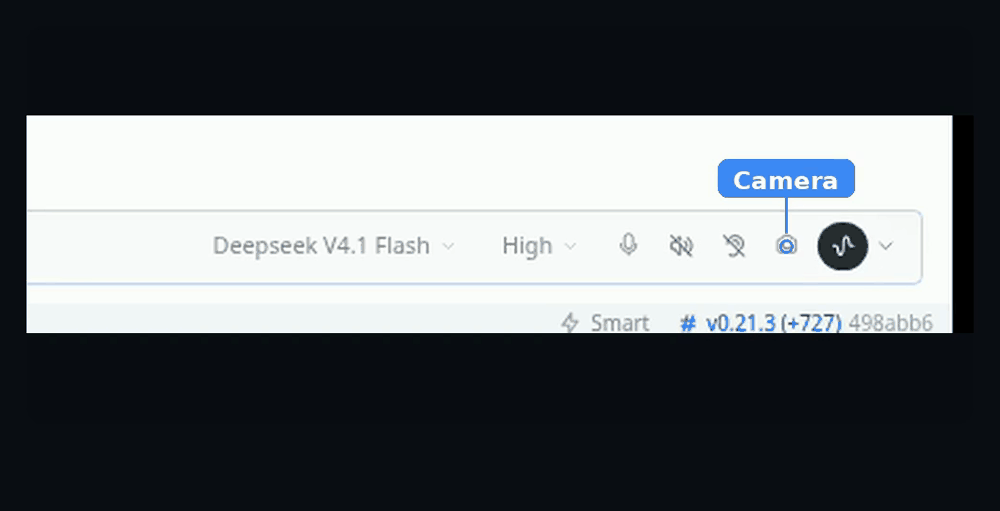

# Hermes Desktop Camera

[](LICENSE)

A camera button for the Hermes Desktop composer. Open the preview, take a photo, and the frame
lands in the composer as an image attachment, ready to send.



## Install

One file in one folder, and the folder name has to match the plugin id. Cloning into the
plugins directory lands it under that name:

```bash
cd ~/.hermes/desktop-plugins
git clone https://github.com/BrokeSkill/hermes-desktop-camera
```

Windows PowerShell:

```powershell
cd $env:LOCALAPPDATA\hermes\desktop-plugins
git clone https://github.com/BrokeSkill/hermes-desktop-camera
```

Without git, create `desktop-plugins/hermes-desktop-camera/` by hand and put `plugin.js` in it.
The app watches that folder and picks the file up within a few seconds. To force it, press
Ctrl/Cmd+K and run **Reload desktop plugins**.

<details>
<summary>Uninstall</summary>

```bash
rm -rf ~/.hermes/desktop-plugins/hermes-desktop-camera
```

Then reload desktop plugins. Deleting an older copy installed under a different folder name
matters too, or the app loads both.

</details>

## Usage

1. Click the camera icon in the composer's control row, or pick **Take a photo** from the "+"
   menu. Both open the same preview.
2. Choose a camera from the selector when more than one is connected.
3. Click **Take photo**. The frame appears in the composer as an attachment chip.

The camera runs only while the preview is open, and the plugin remembers the last device you
used.


## License

MIT. See [LICENSE](LICENSE).
